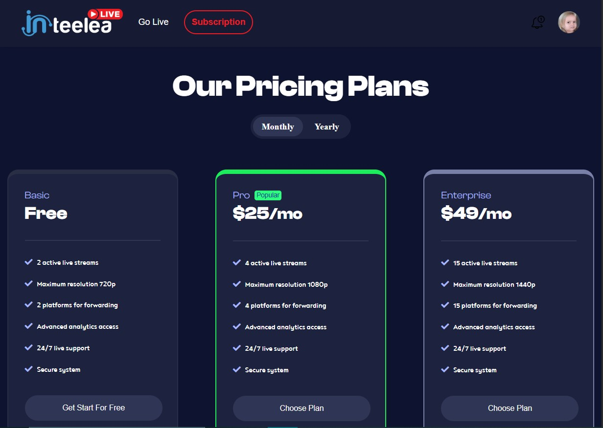
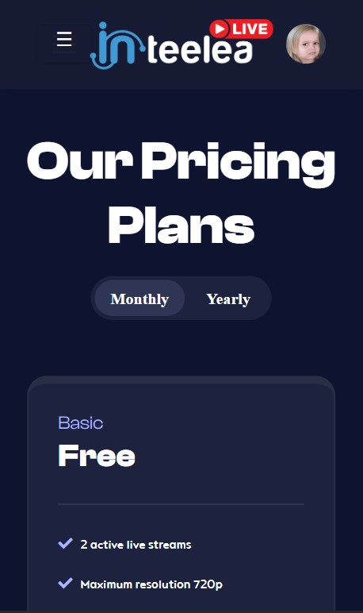
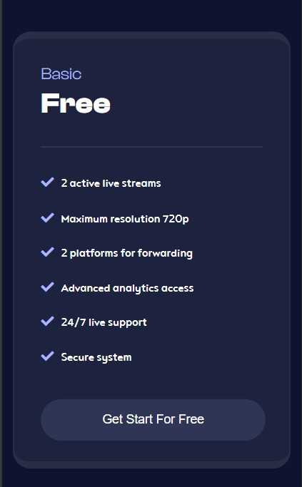

# 💰 Responsive Pricing Plans Page

This is a responsive pricing page built using **Bootstrap 5** and **custom CSS**. It includes a modern navbar and four different pricing plans: Basic, Pro, Enterprise, and Business.

## 📱 Features

- Responsive navbar for desktop and mobile
- Toggle buttons for Monthly/Yearly (visual)
- Four unique pricing cards
- Clean layout using Bootstrap and raw CSS
- Mobile-first design

## 🚀 How to Use

1. Download or clone the repository.
2. Open `index.html` in your browser.
3. Resize the browser window to see how the layout adapts across devices.

## 🖼️ Screenshots

### 🔹 Desktop View

### 🔹 Tablet View

### 🔹 Mobile View

### 🔹  Mobile View 2

